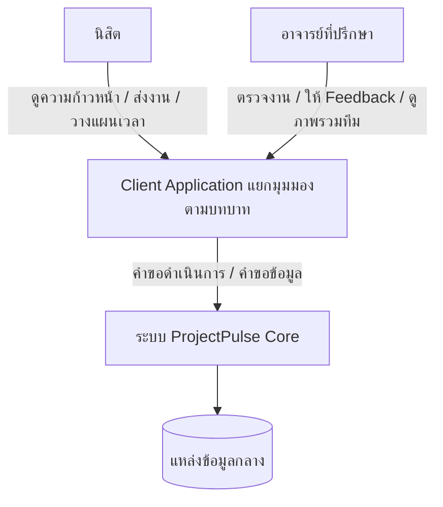
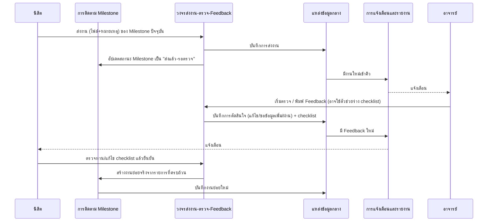
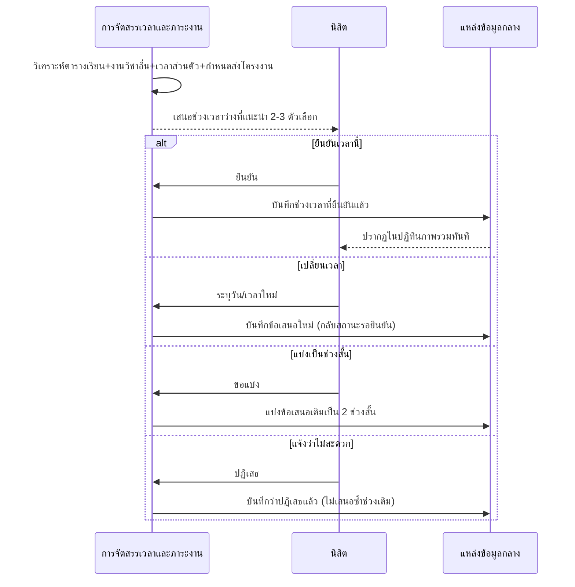
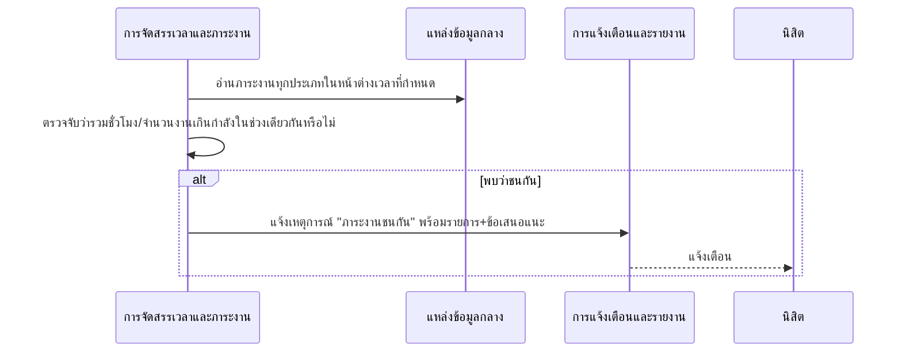
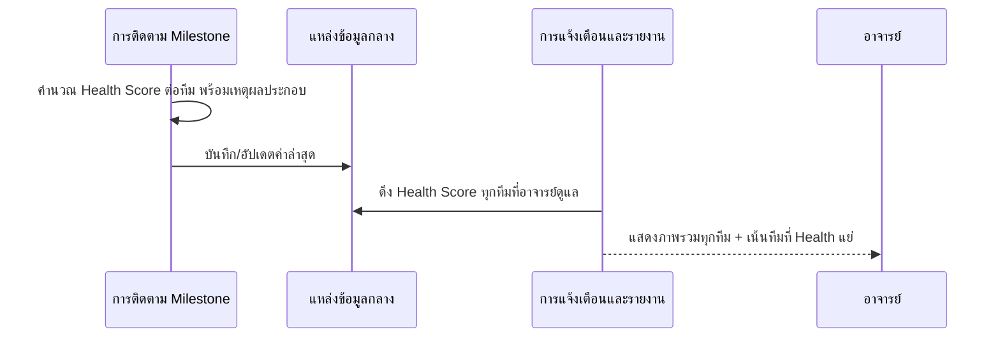
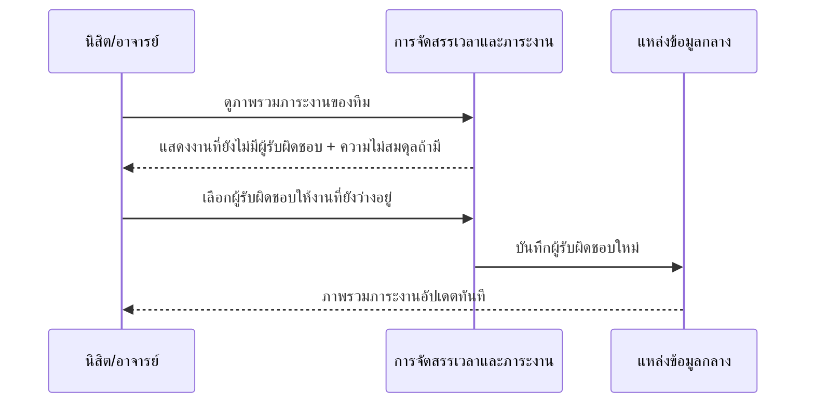

# ARCHITECTURE.md — High-Level Architecture (Conceptual)

เอกสารนี้อธิบาย**ภาพรวมสถาปัตยกรรมระดับแนวคิด (conceptual)** ของระบบ ProjectPulse — เว็บแอปติดตามความก้าวหน้ารายวิชาโครงงานของนิสิตสาขาการสื่อสารสื่อใหม่ มหาวิทยาลัยพะเยา ผู้ใช้มี 2 บทบาท: **นิสิต** และ **อาจารย์ที่ปรึกษา**

**ต่างจาก [SPEC.md](SPEC.md)/[DATA_MODEL.md](DATA_MODEL.md) อย่างไร:** สองไฟล์นั้นผูกกับวิธี implement ปัจจุบัน (เว็บ static HTML/CSS/JS ล้วน เก็บข้อมูลใน localStorage ของเบราว์เซอร์ ผ่านฟังก์ชัน `PP.*`) เอกสารนี้จงใจ**ไม่ผูกกับ implementation ใดๆ ทั้งสิ้น** เพื่อให้ยังอธิบายระบบได้ถูกต้องแม้ทีมจะเปลี่ยนไปทำเป็นระบบมี backend/database จริงในอนาคต — ถ้าอ่านเอกสารนี้แล้วต้องรู้จักคำว่า "localStorage" หรือชื่อฟังก์ชัน `PP.*` ก่อนถึงจะเข้าใจ แสดงว่ามีบางจุดเขียนผิดชั้น

**ใครควรอ่าน:** ใครก็ตามที่ต้องเข้าใจ "รูปทรง" ของระบบก่อนลงรายละเอียดทางเทคนิค เช่น ผู้ประเมินโครงงาน/รายวิชา, สมาชิกทีมใหม่, ผู้ที่จะพัฒนาต่อเป็นระบบมี backend จริง

อ้างอิงจาก [SPEC.md](SPEC.md) (สเปกฟังก์ชันรายหน้าทั้ง 12 หน้า) และ [DATA_MODEL.md](DATA_MODEL.md) (entity/ฟังก์ชันจริง) — ขอบเขตของเอกสารนี้คือ**ทั้งระบบ**ตามที่ปรากฏใน `SPEC.md` ปัจจุบัน

**เอกสารที่เกี่ยวข้องในระดับ conceptual เดียวกัน:** [CONCEPTUAL_DATA_MODEL.md](CONCEPTUAL_DATA_MODEL.md) (entity/attribute/ER diagram) และ [CONCEPTUAL_API_SPEC.md](CONCEPTUAL_API_SPEC.md) (resource/operation) — ทั้งสองเอกสารต่อยอดจาก Conceptual Component ในเอกสารนี้โดยตรง

---

## System Context

**Actor ในระบบ:**

| Actor | บทบาท |
|---|---|
| นิสิต | ดูแดชบอร์ดของทีมตัวเอง จัดการ Milestone/งานย่อย ส่งงานเข้าคิวตรวจ รับ Feedback แล้วยืนยันเป็นงานย่อย วางแผนเวลาว่าง ดูภาระงานของทีม รับการแจ้งเตือน |
| อาจารย์ที่ปรึกษา | ดูภาพรวมทุกทีมที่ดูแล จัดคิวงานรอตรวจ ให้ Feedback และตัดสิน (แก้ไข/ขอข้อมูลเพิ่ม/ผ่าน Milestone) ตั้งค่ากรอบเวลา Feedback รับการแจ้งเตือน |

ผู้ใช้แต่ละคนสังกัด**ทีม**เดียว (นิสิต) หรือดูแลได้**หลายทีม** (อาจารย์) — ทุกการเข้าถึงข้อมูลต้องกรองตามทีม/สิทธิ์ของผู้ใช้ปัจจุบันเสมอ ไม่มีระบบ/บริการภายนอกในขอบเขตปัจจุบัน (ไม่มีการอัปโหลดไฟล์จริง ไม่มี SSO/ระบบยืนยันตัวตนกลางของมหาวิทยาลัยเชื่อมต่ออยู่)

ไม่มี client ต่อแหล่งข้อมูลกลางโดยตรง — ทุกการอ่าน/เขียนต้องผ่าน Core เสมอ (ดูหัวข้อ "หลักการเชิง architecture" ด้านล่าง)

---

## Conceptual Components

แบ่งระดับ **medium-grained ตามความรับผิดชอบหลัก** — สอดคล้องกับกลุ่มหน้าใน `SPEC.md` โดยตรง แต่ตั้งชื่อตามหน้าที่ ไม่ใช่ตามชื่อไฟล์/หน้า

### 1. การติดตาม Milestone และความก้าวหน้า (Milestone & Progress Tracking)

- **รับผิดชอบ:** ดูแล 10 ขั้น Milestone มาตรฐานต่อทีม (รวมช่วงวันที่/ชั่วโมงประมาณ/การพึ่งพาระหว่างขั้น), งานย่อยใต้แต่ละ Milestone (เพิ่ม/ทำเครื่องหมายเสร็จ), ไฟล์แนบ, ประวัติการเปลี่ยนแปลงสถานะ, คำนวณ % ความก้าวหน้าโดยรวมของทีมและ Health Score พร้อมเหตุผลประกอบเสมอ
- **ไม่รับผิดชอบ:** การตัดสินว่างานที่ส่งผ่านหรือไม่ (เป็นของ วงจรส่งงาน-ตรวจ-Feedback — component นี้แค่รับผลลัพธ์มาปรับสถานะ Milestone ต่อ), การจัดสรรว่าใครมีเวลาว่างทำงานย่อยเมื่อไหร่ (เป็นของ การจัดสรรเวลาและภาระงาน)

### 2. วงจรส่งงาน-ตรวจ-Feedback (Submission & Feedback Review Cycle)

- **รับผิดชอบ:** รับคำขอส่งงานของ Milestone ปัจจุบันเข้าคิวตรวจจากนิสิต, จัดลำดับความสำคัญของคิวให้อาจารย์ (ตามเวลารอ/ความเสี่ยง/สิ่งที่ถูกบล็อกไว้), บันทึกการตัดสินใจของอาจารย์ 3 แบบ (ต้องแก้ไข / ขอข้อมูลเพิ่มเติม / ผ่าน Milestone), ช่วยแยกข้อความ Feedback อิสระเป็นรายการ checklist ให้อาจารย์ตรวจทานก่อนบันทึกจริง (เป็นเพียงตัวช่วยร่าง ไม่ตัดสินใจแทน), รับการยืนยัน checklist จากนิสิต แล้วส่งต่อให้กลายเป็นงานย่อยจริงใน Milestone
- **ไม่รับผิดชอบ:** การอนุมัติ/ให้คะแนนอัตโนมัติโดยไม่มีอาจารย์ตัดสินใจ (ต้องเป็นดุลยพินิจอาจารย์เสมอ `[หลักการสำคัญ]`), การแก้ไขสถานะ/งานย่อยของ Milestone โดยตรง (ส่งต่อผลลัพธ์ให้ การติดตาม Milestone เปลี่ยนสถานะแทน)

### 3. การจัดสรรเวลาและภาระงาน (Time & Workload Allocation)

- **รับผิดชอบ:** รวมภาระงานทุกประเภทของนิสิตแต่ละคน (ตารางเรียน, งานวิชาอื่น, งานโครงงาน/Milestone, เวลาส่วนตัว) เป็นภาพรวมตลอดภาคการศึกษา, ตรวจจับช่วงเวลาที่ภาระงานชนกัน/เกินกำลัง (deadline collision) แล้วเสนอทางแก้, แนะนำช่วงเวลาว่างที่เหมาะกับการทำงานโครงงาน พร้อมให้นิสิตยืนยัน/เปลี่ยนเวลา/แบ่งเป็นช่วงสั้น/ปฏิเสธได้จริง, สรุปภาระงานรายสมาชิกในทีมและชี้ว่างานใดยังไม่มีผู้รับผิดชอบ พร้อมตรวจจับความไม่สมดุลของภาระงานในทีม
- **ไม่รับผิดชอบ:** เนื้อหารายละเอียดของงานที่ถูกจัดสรร (รู้แค่ชั่วโมงประมาณ/กำหนดส่ง เป็นของ การติดตาม Milestone), การตัดสินใจว่างานผ่านหรือไม่

### 4. การแจ้งเตือนและรายงานภาพรวม (Notification & Reporting)

- **รับผิดชอบ:** กระจายเหตุการณ์สำคัญที่เกิดจาก component อื่น (งานใหม่เข้าคิวตรวจ, Feedback พร้อมให้นิสิตดู, ใกล้/เกินกำหนดส่ง, ทีมมี Health แย่ลง) ไปยังผู้ใช้ที่เกี่ยวข้องตามบทบาทและระดับความรุนแรง, ให้ผู้ใช้ทำเครื่องหมายอ่านแล้วทีละรายการ/ทั้งหมด, สรุปรายงานความก้าวหน้ารายสัปดาห์ต่อทีม (ฝั่งนิสิต) และภาพรวมทุกทีมเทียบเป้าหมายของการทดลองใช้รายวิชา (ฝั่งอาจารย์)
- **ไม่รับผิดชอบ:** การตัดสินใจเชิงธุรกิจว่าเมื่อไหร่ควรมีเหตุการณ์เกิดขึ้น (รับ trigger จาก component อื่นเท่านั้น ไม่ริเริ่มเหตุการณ์เอง), การคำนวณ Health Score เอง (อ่านผลจาก การติดตาม Milestone มาแสดง/สรุปต่อ)

### 5. การตั้งค่ากรอบเวลาและรายวิชา (Course & Settings Configuration) — *cross-cutting*

- **รับผิดชอบ:** เก็บข้อมูลรายวิชา/ภาคการศึกษา (ช่วงเวลา 16 สัปดาห์), ค่ากรอบเวลาที่อาจารย์ต้องให้ Feedback ภายในกี่วัน, ระยะเวลาที่ควรเตือนล่วงหน้าก่อนกำหนดส่ง, ระดับสิทธิ์การแก้ไข (อาจารย์แก้ค่ากรอบเวลากลางได้ นิสิตเห็นค่าปัจจุบันแบบอ่านอย่างเดียวและแก้ได้เฉพาะการแจ้งเตือนส่วนตัวของตนเอง)
- **ไม่รับผิดชอบ:** การบังคับใช้ค่าที่ตั้งไว้จริง (เป็นของ component อื่นที่ต้องอ่านค่าไปใช้ เช่น การแจ้งเตือนและรายงานภาพรวมอ่านระยะเวลาแจ้งเตือนไปใช้ตัดสินใจว่าจะแจ้งเมื่อไหร่)

### 6. อัตลักษณ์ผู้ใช้และขอบเขตสิทธิ์ (Identity & Role Context) — *cross-cutting*

- **รับผิดชอบ:** ระบุตัวตนผู้ใช้ปัจจุบันและบทบาท (นิสิต/อาจารย์) พร้อมทีม/รายชื่อทีมที่เกี่ยวข้อง, เป็นจุดเดียวที่ component อื่นต้องตรวจสอบก่อนแสดงข้อมูล/อนุญาต action เฉพาะบทบาท (เช่น เฉพาะอาจารย์เท่านั้นที่ทำให้ Milestone มีสถานะ "ผ่าน" ได้)
- **ไม่รับผิดชอบ:** เนื้อหาของแต่ละ component (แค่บอกว่า "ใครคือใคร มีสิทธิ์อะไร" ให้ component อื่นนำไปใช้ตัดสินใจต่อ)

### 7. แหล่งข้อมูลกลาง (Central Data Store) — *cross-cutting*

- **รับผิดชอบ:** เป็นแหล่งความจริงกลางเพียงหนึ่งเดียว (single source of truth) สำหรับข้อมูลทุกประเภทของระบบ (ทีม, Milestone, งานย่อย, การส่งงาน, Feedback, การแจ้งเตือน, ตารางเวลา ฯลฯ) ทุก component เข้าถึงผ่าน Core เท่านั้น
- **ไม่รับผิดชอบ:** การแจ้งเตือนผู้ใช้ (เป็นของ การแจ้งเตือนและรายงานภาพรวม), การตัดสินใจทาง business logic ใดๆ (เก็บ/คืนข้อมูลตามที่ Core สั่งเท่านั้น)

---

## Data Flow ตาม Scenario การใช้งาน

### Scenario A — นิสิตส่งงานเข้าคิวตรวจ จนถึงยืนยันงานย่อยจาก Feedback

อ้างอิง [SPEC.md](SPEC.md) หัวข้อ Task Detail, Feedback Queue, Review & Feedback, Feedback-to-Task

Decision point: ถ้าอาจารย์เลือก "ผ่าน Milestone" → วงจรส่งงาน-ตรวจ-Feedback ต้องส่งสัญญาณให้การติดตาม Milestone ปลดล็อกลำดับ Milestone ถัดไปของทีมด้วยเสมอ (ไม่ใช่แค่เปลี่ยนสถานะ Milestone ปัจจุบัน)

Decision point: ก่อนนิสิตยืนยัน checklist ได้ ทุกแถวต้องมีผู้รับผิดชอบและกำหนดส่งครบก่อนเสมอ — ไม่ครบ ปฏิเสธการยืนยันพร้อมระบุว่าขาดอะไร

`[ต้องพิจารณา PDPA]` ผลการประเมิน/Feedback รายบุคคลและระดับความสามารถของนิสิตถือเป็นข้อมูลที่ละเอียดอ่อนต่อการเรียน ควรจำกัดการมองเห็นเฉพาะเจ้าของงานและอาจารย์ที่ปรึกษาทีมนั้นเท่านั้น

### Scenario B — ระบบแนะนำเวลาว่างและนิสิตตัดสินใจ

อ้างอิง [SPEC.md](SPEC.md) หัวข้อ Smart Free-Time Planner

Decision point: การจัดสรรเวลาและภาระงานต้องพิจารณาภาระงานทุกประเภทที่มีอยู่แล้ว (ไม่ใช่แค่กำหนดส่งโครงงาน) ก่อนเสนอช่วงเวลาเสมอ กันการแนะนำเวลาที่ทับซ้อนกับภาระอื่นของนิสิต

### Scenario C — ตรวจจับภาระงานชนกันและแจ้งเตือน

อ้างอิง [SPEC.md](SPEC.md) หัวข้อ Semester Workload Map, DATA_MODEL.md ฟังก์ชัน deadline collision

Decision point: หน้าต่างเวลาที่ถือว่า "ชนกัน" เป็นค่าที่ตั้งได้ผ่าน การตั้งค่ากรอบเวลาและรายวิชา ไม่ hardcode ไว้ใน component นี้

### Scenario D — คำนวณ Health Score และแสดงผลรวมทุกทีม

อ้างอิง [SPEC.md](SPEC.md) หัวข้อ Advisor Dashboard, Weekly Report

Decision point: Health Score ต้องมาพร้อมเหตุผลเสมอทุกครั้งที่แสดงผล ห้ามแสดงแค่ตัวเลข/สีเปล่าๆ (เป็นตัวชี้วัดความเสี่ยง ไม่ใช่คะแนนตัดสินผลการเรียน)

### Scenario E — มอบหมายงานที่ยังไม่มีผู้รับผิดชอบในทีม

อ้างอิง [SPEC.md](SPEC.md) หัวข้อ Team Workload

---

## หลักการ/การตัดสินใจเชิง architecture ระดับ conceptual

- **Core เป็นแหล่งความจริงเดียวเสมอ (single source of truth):** client ทุกตัว (มุมมองนิสิต/อาจารย์) ไม่เก็บ state ที่ถือว่า "เชื่อถือได้" ด้วยตัวเอง ต้องขอ/ตรวจกับ Core ก่อนแสดงข้อมูลสำคัญเสมอ
- **ไม่มี client ต่อแหล่งข้อมูลกลางโดยตรง:** ทุกการอ่าน/เขียนต้องผ่าน Core เพื่อให้มีจุดเดียวที่บังคับ business rule (เช่น ตรวจ checklist ครบก่อนยืนยัน, ตรวจสิทธิ์บทบาทก่อนอนุมัติผ่าน Milestone)
- **การอนุมัติ/ตัดสินคุณภาพงานเป็นดุลยพินิจของอาจารย์เท่านั้น:** ตัวช่วย AI ร่าง checklist จากข้อความ Feedback ทำหน้าที่แค่ช่วยแยกประเด็นให้ทบทวนก่อนบันทึกจริง **ไม่มีสิทธิ์ตัดสินคะแนน/อนุมัติผ่านแทนอาจารย์** — ทุกหน้าที่แสดงผลลัพธ์จากตัวช่วยนี้ต้องระบุชัดว่าเป็นการเสนอ ไม่ใช่ผลตัดสิน
- **นิสิตไม่มีสิทธิ์เปลี่ยนสถานะงานเป็น "ผ่าน" เอง:** ทำได้แค่ส่งงาน/ทำเครื่องหมายงานย่อยเสร็จ/ยืนยัน checklist เท่านั้น สถานะ "ผ่าน" ต้องมาจาก วงจรส่งงาน-ตรวจ-Feedback ที่อาจารย์เป็นผู้ยืนยันเสมอ
- **ทุกการเข้าถึงข้อมูลต้องกรองตามทีม/บทบาทที่ อัตลักษณ์ผู้ใช้และขอบเขตสิทธิ์ ยืนยันมาแล้ว:** ไม่พึ่งพา state เดิมของ client (กันกรณีสลับบทบาท/สลับทีมแล้วเห็นข้อมูลทีมอื่นหลุดมา)
- **การเปลี่ยนแปลงสถานะต้องทนต่อการทำซ้ำ (idempotency):** เช่น กดยืนยันงานส่งซ้ำ, กดยืนยัน checklist ซ้ำ ต้องไม่สร้างงานย่อยซ้ำหรือส่งงานซ้ำโดยไม่ตั้งใจ
- **ทุก action ที่อาจล้มเหลวต้องให้ feedback ชัดเจนแก่ผู้ใช้เสมอ ห้ามเงียบ:** ทั้งฝั่งนิสิต (ส่งงาน, ยืนยันเวลาว่าง) และฝั่งอาจารย์ (ให้ Feedback, ตั้งค่ากรอบเวลา)

---

## Non-functional Considerations

ระบุเฉพาะระดับหลักการกว้างๆ (ไม่ผูกตัวเลข/เทคโนโลยีเฉพาะเจาะจง)

- **ทิศทาง Scalability ที่คาดไว้:** ระบบออกแบบมาสำหรับ 1 รายวิชาต่อภาคการศึกษาที่มีหลายทีมพร้อมกัน (ระดับสิบถึงหลายสิบทีม) และอาจารย์ที่ปรึกษาหลายคนดูแลคนละกลุ่มทีม ไม่ใช่ระบบระดับมหาวิทยาลัยทั้งหมดในรอบนี้
- **ความคาดหวังด้านความสดของข้อมูล:** ผู้ใช้ควรเห็นผลของ action ที่ทำเอง (ส่งงาน, ให้ Feedback, ยืนยันเวลาว่าง) ทันทีโดยไม่ต้องรีเฟรชเอง การแจ้งเตือนไปยังผู้ใช้อื่นไม่จำเป็นต้องเป็นเรียลไทม์ระดับวินาที แต่ต้องมาถึงภายในเวลาที่มนุษย์รับรู้ว่า "เร็วพอ" สำหรับงานลักษณะรายสัปดาห์
- **ความทนทานของข้อมูล (durability):** ข้อมูลความก้าวหน้า/การส่งงาน/Feedback ต้องไม่สูญหายเพียงเพราะผู้ใช้ปิด/เปิดอุปกรณ์ใหม่ เปลี่ยนเบราว์เซอร์ หรือรีเฟรชหน้าจอ เพราะ Core ต้องเป็นแหล่งความจริงที่อยู่ฝั่งเดียวกันเสมอ ไม่ใช่ฝั่ง client
- **ความเป็นส่วนตัวของข้อมูลข้ามทีม:** อาจารย์เห็นได้เฉพาะทีมที่ตนดูแล นิสิตเห็นได้เฉพาะข้อมูลทีมตัวเอง — ไม่มีการรั่วไหลของ Feedback/ผลประเมิน/เวลาส่วนตัวข้ามทีม/ข้ามอาจารย์
- **ความสม่ำเสมอเมื่อมีการทำงานพร้อมกัน (consistency under concurrency):** เมื่อสมาชิกหลายคนในทีมเดียวกันแก้ไขทรัพยากรเดียวกันพร้อมกัน (เช่น มอบหมายงานเดียวกันให้คนละคน, ทำเครื่องหมายงานย่อยเสร็จพร้อมกัน) ระบบต้องมีกลไกป้องกันสถานะขัดแย้งกัน — **วิธีทำ (transaction/lock ฯลฯ) เป็นการตัดสินใจของ implementation** เอกสารนี้ระบุแค่หลักการว่าต้องมี

---

## Open Questions / Assumptions

- **ขอบเขตข้อมูลส่วนบุคคล/PDPA:** Feedback รายบุคคล, ผลการประเมิน, และเวลาส่วนตัว/เวลานอนของนิสิตถือเป็นข้อมูลละเอียดอ่อนต่อการเรียน — เอกสารนี้ตั้งสมมติฐานว่าจำกัดการมองเห็นเฉพาะเจ้าของข้อมูลและอาจารย์ที่ปรึกษาทีมนั้น ควรได้รับการยืนยันจากเจ้าของวิชา/ผู้ดูแลข้อมูลก่อนใช้งานจริงกับนิสิตจริง
- **การยืนยันตัวตนผู้ใช้:** `SPEC.md`/`DATA_MODEL.md` ปัจจุบันสมมติว่ามี "ผู้ใช้ปัจจุบัน" อยู่แล้วเสมอ (ระบุ role+teamId/advisorId) โดยไม่มีขั้นตอนล็อกอิน/ยืนยันตัวตนจริงในสเปกต้นทาง เอกสารนี้จึงไม่ระบุกลไกยืนยันตัวตนที่เจาะจง แต่หลักการที่ต้องยึดคือ "ทุกคำขอต้องพิสูจน์ได้ว่าเป็นใคร บทบาทอะไร" ไม่ว่าจะเลือกกลไกใดภายหลัง
- **การแจ้งเตือนแบบ push จริง:** สเปกต้นทางอธิบาย "ระบบแจ้งเตือน" ในระดับแนวคิด แต่ไม่ได้ระบุว่าต้องเป็น push แบบเรียลไทม์หรือ poll เป็นระยะ — เอกสารนี้เว้นว่างไว้เป็นการตัดสินใจของ implementation ระบุแค่หลักการด้าน timeliness ในหัวข้อ Non-functional Considerations

---

## ความสัมพันธ์กับ Data Model และ Implementation ปัจจุบัน

เอกสาร [DATA_MODEL.md](DATA_MODEL.md) คือการนำ Conceptual Component ทั้ง 7 ตัวในเอกสารนี้ไปแปลงเป็น implementation จริงบนชั้นข้อมูล client-side ปัจจุบัน (localStorage ผ่านฟังก์ชัน `PP.*`) — ตัวอย่างการแปลงที่ทำไปแล้ว:

| Conceptual Component (เอกสารนี้) | ถูกแปลงเป็น (ใน `DATA_MODEL.md`) |
|---|---|
| การติดตาม Milestone และความก้าวหน้า | โครงสร้าง `Milestone` object + `PP.toggleSubtask`/`PP.addSubtask`/`PP.computeHealthScore` |
| วงจรส่งงาน-ตรวจ-Feedback | `PP.submitMilestone`/`PP.feedbackQueue`/`PP.giveFeedback`/`PP.confirmChecklist` |
| การจัดสรรเวลาและภาระงาน | `PP.getFreeTimeSuggestions`/`PP.detectDeadlineCollision`/`PP.teamWorkload`/`PP.dayEvents` |
| การแจ้งเตือนและรายงานภาพรวม | `PP.getNotificationsFor`/`PP.weeklyReport`/`PP.overallExperimentMetrics` |
| การตั้งค่ากรอบเวลาและรายวิชา | `PP.getSettings`/`PP.updateSettings`/`PP.getCourse` |
| อัตลักษณ์ผู้ใช้และขอบเขตสิทธิ์ | `PP.getCurrentUser`/`PP.setRole`/`PP.setCurrentTeam` |
| แหล่งข้อมูลกลาง | localStorage ผ่าน `PP.commit()` อัตโนมัติหลังทุก mutation |

ถ้าทีมเปลี่ยนไป implement เป็นระบบมี backend/database จริงในอนาคต เอกสารนี้ควรยังคงถูกต้องโดยไม่ต้องแก้ไข — ถ้าพบว่าต้องแก้เอกสารนี้ตามการเปลี่ยน implementation แสดงว่ามีเนื้อหาบางจุดผูกกับเทคโนโลยีไปโดยไม่ตั้งใจ ควรทบทวนใหม่
