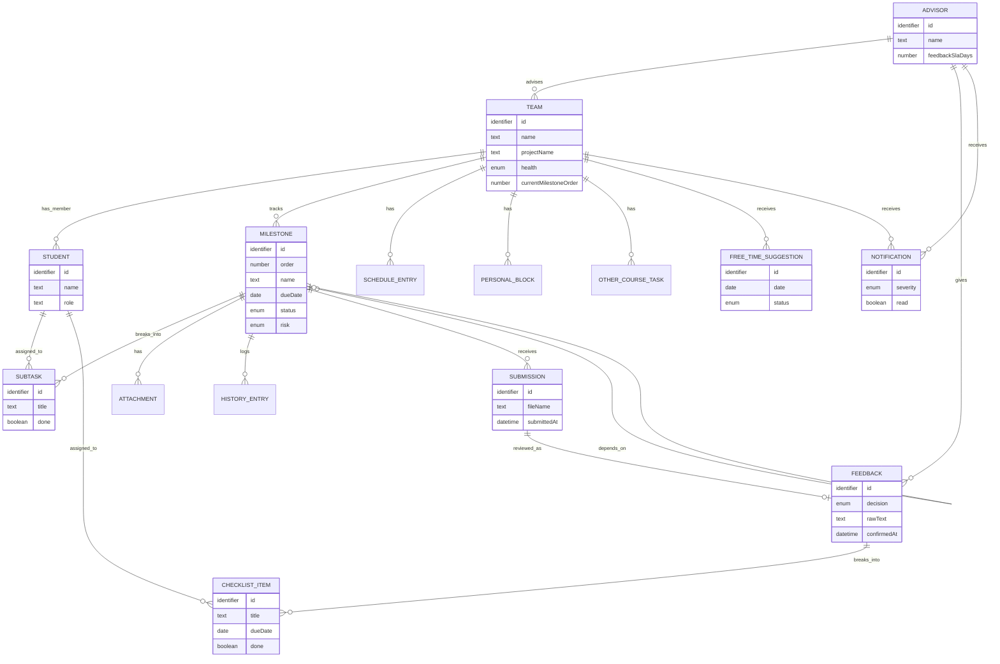

# CONCEPTUAL_DATA_MODEL.md — Conceptual Data Model

เอกสารนี้อธิบาย**แบบจำลองข้อมูลระดับแนวคิด (conceptual)** ของระบบ ProjectPulse — entity/attribute/ความสัมพันธ์ที่ระบบต้อง "จำ" ไว้เพื่อทำงานตาม [SPEC.md](SPEC.md) โดย**ไม่ผูกกับ implementation ปัจจุบัน** ต่างจาก [DATA_MODEL.md](DATA_MODEL.md) ตรงที่เอกสารนั้นเป็นการนำ entity เหล่านี้ไปแปลงเป็นชั้นข้อมูลจริงบน localStorage ผ่านฟังก์ชัน `PP.*` — ถ้าทีมเปลี่ยนไปทำระบบมี backend/database จริง เอกสารนี้ควรยังคงถูกต้องโดยไม่ต้องแก้

อ้างอิง [ARCHITECTURE.md](ARCHITECTURE.md) สำหรับ Conceptual Component ที่ใช้จัดกลุ่ม entity ด้านล่าง และ [CONCEPTUAL_API_SPEC.md](CONCEPTUAL_API_SPEC.md) สำหรับ operation ที่ทำงานกับ entity เหล่านี้

---

## รายชื่อ Entity

| Entity | หน้าที่/ความหมายทางธุรกิจ | เกี่ยวข้องกับ Component |
|---|---|---|
| ทีม (Team) | หน่วยของนิสิตที่ทำโครงงานร่วมกัน 1 โครงงาน มีอาจารย์ที่ปรึกษา 1 คน | การติดตาม Milestone / อัตลักษณ์ผู้ใช้ |
| นิสิต (Student) | สมาชิกในทีม | อัตลักษณ์ผู้ใช้ |
| อาจารย์ที่ปรึกษา (Advisor) | ผู้ดูแลทีมได้หลายทีม ตัดสินคุณภาพงาน | อัตลักษณ์ผู้ใช้ |
| รายวิชา (Course) | บริบทภาคการศึกษาที่ทุกทีมสังกัดร่วมกัน (16 สัปดาห์) | การตั้งค่ากรอบเวลาและรายวิชา |
| การตั้งค่า (Settings) | ค่ากรอบเวลา Feedback และการแจ้งเตือนที่ปรับได้ | การตั้งค่ากรอบเวลาและรายวิชา |
| นิยาม Milestone มาตรฐาน (Milestone Definition) | แม่แบบ 10 ขั้นที่ทุกทีมต้องผ่านเหมือนกัน | การติดตาม Milestone |
| Milestone (ของทีม) | ความก้าวหน้าจริงของทีมในแต่ละขั้น | การติดตาม Milestone |
| งานย่อย (Subtask) | งานย่อยที่แตกจาก Milestone หรือจาก Checklist ที่ยืนยันแล้ว | การติดตาม Milestone |
| ไฟล์แนบ (Attachment) | ไฟล์ประกอบที่แนบไว้กับ Milestone | การติดตาม Milestone |
| ประวัติการเปลี่ยนแปลง (History Entry) | บันทึกเหตุการณ์สำคัญของ Milestone ตามเวลา | การติดตาม Milestone |
| การส่งงานตรวจ (Submission) | คำขอให้อาจารย์ตรวจงานของ Milestone หนึ่งครั้ง | วงจรส่งงาน-ตรวจ-Feedback |
| Feedback | ผลการตรวจ+การตัดสินใจของอาจารย์ต่อ 1 การส่งงาน | วงจรส่งงาน-ตรวจ-Feedback |
| รายการ Checklist (Checklist Item) | ประเด็นย่อยที่แตกออกจาก Feedback รอนิสิตยืนยัน | วงจรส่งงาน-ตรวจ-Feedback |
| ตารางเรียน (Schedule Entry) | ภาระเวลาประจำจากตารางเรียน | การจัดสรรเวลาและภาระงาน |
| เวลาส่วนตัว (Personal Block) | ช่วงเวลาที่ไม่สะดวกทำงานประจำ (เช่น เวลานอน) | การจัดสรรเวลาและภาระงาน |
| งานวิชาอื่น (Other Course Task) | ภาระงานจากวิชาอื่นที่แย่งเวลากับโครงงาน | การจัดสรรเวลาและภาระงาน |
| ช่วงเวลาว่างที่แนะนำ (Free-Time Suggestion) | ข้อเสนอเวลาว่างที่ระบบแนะนำให้ทำงานโครงงาน | การจัดสรรเวลาและภาระงาน |
| การแจ้งเตือน (Notification) | เหตุการณ์ที่ต้องแจ้งผู้ใช้ตามบทบาท | การแจ้งเตือนและรายงานภาพรวม |

---

## รายละเอียดแต่ละ Entity

### ทีม (Team)

| Attribute | ชนิดข้อมูล | คำอธิบาย | หมายเหตุ |
|---|---|---|---|
| id | identifier | รหัสอ้างอิงทีม | unique |
| name | text | ชื่อทีม | |
| projectType | text | ประเภทโครงงาน | |
| projectName | text | ชื่อโครงงาน | |
| advisorId | identifier | อาจารย์ที่ปรึกษาของทีม | อ้างอิง อาจารย์ที่ปรึกษา |
| pace | enum | จังหวะความคืบหน้าเทียบแผน | ค่าที่เป็นไปได้ขึ้นกับการตีความ implementation |
| health | enum | ระดับความเสี่ยงล่าสุดของทีม | `เขียว` / `เหลือง` / `แดง` — มาจากการคำนวณ Health Score |
| currentMilestoneOrder | number | ลำดับ Milestone ที่ทีมทำถึงปัจจุบัน | ปลดล็อกเพิ่มเมื่ออาจารย์อนุมัติผ่านขั้นก่อนหน้า |
| blocksNext | boolean | มีสิ่งกีดขวางไม่ให้ไป Milestone ถัดไปหรือไม่ | |
| inactivityDays | number | จำนวนวันที่ทีมไม่มีความเคลื่อนไหว | ใช้เตือนทีมที่เงียบหายไปนาน |

### นิสิต (Student)

| Attribute | ชนิดข้อมูล | คำอธิบาย | หมายเหตุ |
|---|---|---|---|
| id | identifier | รหัสอ้างอิงนิสิต | unique |
| name | text | ชื่อนิสิต | `[ต้องพิจารณา PDPA]` |
| role | text | บทบาทในทีม (เช่น หัวหน้าทีม/สมาชิก) | |
| teamId | identifier | ทีมที่สังกัด | อ้างอิง ทีม |

### อาจารย์ที่ปรึกษา (Advisor)

| Attribute | ชนิดข้อมูล | คำอธิบาย | หมายเหตุ |
|---|---|---|---|
| id | identifier | รหัสอ้างอิงอาจารย์ | unique |
| name | text | ชื่ออาจารย์ | `[ต้องพิจารณา PDPA]` |
| initials | text | อักษรย่อสำหรับแสดงผลแบบย่อ | |
| feedbackSlaDays | number | กรอบเวลาให้ Feedback เฉพาะของอาจารย์คนนี้ (ถ้าต่างจากค่ากลาง) | |

### รายวิชา (Course)

| Attribute | ชนิดข้อมูล | คำอธิบาย | หมายเหตุ |
|---|---|---|---|
| code | text | รหัสวิชา | |
| name | text | ชื่อวิชา | |
| program | text | สาขาวิชา | |
| semesterLabel | text | ป้ายกำกับภาคการศึกษา | |
| weeks | number | จำนวนสัปดาห์ทั้งภาค | ค่าเริ่มต้น 16 |
| startDate / endDate | date | ช่วงวันที่ของภาคการศึกษา | |
| currentWeek | number | สัปดาห์ปัจจุบัน | |
| feedbackTargetDays | number | เป้าหมายจำนวนวันรอ Feedback สูงสุด | ใช้เป็นค่าเริ่มต้นของ Settings |

### การตั้งค่า (Settings)

| Attribute | ชนิดข้อมูล | คำอธิบาย | หมายเหตุ |
|---|---|---|---|
| feedbackSlaDays | number | กรอบเวลาที่อาจารย์ควรให้ Feedback ภายในกี่วัน | แก้ได้โดยอาจารย์ |
| reminderMilestones | list(number) | วันล่วงหน้าที่ควรเตือนก่อนกำหนดส่ง | เช่น 1/3/5/7 วัน |
| studentInactivityDays | number | จำนวนวันไม่มีความเคลื่อนไหวก่อนถือว่าเงียบหาย | |
| deadlineCollisionWindowHours | number | หน้าต่างเวลาที่ถือว่าภาระงาน "ชนกัน" | หน่วยชั่วโมง |
| studentDeadlineReminders | list(number) | วันล่วงหน้าที่เตือนนิสิตก่อนกำหนดส่ง | |
| notifyChannels | object | ช่องทางแจ้งเตือนที่เปิดใช้งาน | เช่น ในระบบ/อีเมล |

### นิยาม Milestone มาตรฐาน (Milestone Definition)

| Attribute | ชนิดข้อมูล | คำอธิบาย | หมายเหตุ |
|---|---|---|---|
| order | number | ลำดับขั้น | 1-10 |
| key | identifier | รหัสอ้างอิงขั้น | |
| name | text | ชื่อขั้น | |
| startWeek / endWeek | number | สัปดาห์ที่ควรเริ่ม/จบขั้นนี้ตามแผนมาตรฐาน | |

### Milestone (ของทีม)

| Attribute | ชนิดข้อมูล | คำอธิบาย | หมายเหตุ |
|---|---|---|---|
| id | identifier | รหัสอ้างอิง | unique |
| teamId | identifier | ทีมเจ้าของ | อ้างอิง ทีม |
| order / key / name | ตามนิยามมาตรฐาน | คัดลอกมาจาก Milestone Definition ตอนสร้าง | |
| startDate / dueDate / completedDate | date | วันเริ่ม/กำหนดส่ง/วันที่เสร็จจริง | completedDate ว่างได้จนกว่าจะผ่าน |
| hoursEstimate | number | ชั่วโมงที่ประมาณว่าต้องใช้ | |
| dependsOn | identifier (nullable) | Milestone ก่อนหน้าที่ต้องผ่านก่อน | self-reference |
| status | enum | สถานะปัจจุบัน | ดูหัวข้อ "สถานะ/lifecycle" ด้านล่าง |
| risk | enum | ระดับความเสี่ยง | `ต่ำ` / `ปานกลาง` / `สูง` |

### งานย่อย (Subtask)

| Attribute | ชนิดข้อมูล | คำอธิบาย | หมายเหตุ |
|---|---|---|---|
| id | identifier | รหัสอ้างอิง | unique |
| milestoneId | identifier | Milestone ที่สังกัด | อ้างอิง Milestone |
| title | text | รายละเอียดงาน | |
| assigneeId | identifier (nullable) | นิสิตผู้รับผิดชอบ | ว่างได้ = ยังไม่มอบหมาย |
| done | boolean | ทำเสร็จแล้วหรือยัง | |

### ไฟล์แนบ (Attachment)

| Attribute | ชนิดข้อมูล | คำอธิบาย | หมายเหตุ |
|---|---|---|---|
| milestoneId | identifier | Milestone ที่แนบไฟล์นี้ | อ้างอิง Milestone |
| name | text | ชื่อไฟล์ | |
| uploadedAt | date-time | วันเวลาที่แนบ | |

### ประวัติการเปลี่ยนแปลง (History Entry)

| Attribute | ชนิดข้อมูล | คำอธิบาย | หมายเหตุ |
|---|---|---|---|
| milestoneId | identifier | Milestone ที่เกี่ยวข้อง | อ้างอิง Milestone |
| date | date-time | เวลาที่เกิดเหตุการณ์ | |
| note | text | รายละเอียดเหตุการณ์ | |

### การส่งงานตรวจ (Submission)

| Attribute | ชนิดข้อมูล | คำอธิบาย | หมายเหตุ |
|---|---|---|---|
| id | identifier | รหัสอ้างอิง | unique |
| milestoneId | identifier | Milestone ที่ส่งตรวจ | อ้างอิง Milestone |
| teamId | identifier | ทีมผู้ส่ง | อ้างอิง ทีม |
| fileName | text (nullable) | ชื่อไฟล์ที่แนบมา | |
| note | text (nullable) | หมายเหตุถึงอาจารย์ | |
| submittedAt | date-time | เวลาที่ส่ง | ใช้คำนวณจำนวนวันที่รอตรวจ |
| status | enum | สถานะการตรวจ | อิงตามสถานะของ Milestone ที่เกี่ยวข้อง |

### Feedback

| Attribute | ชนิดข้อมูล | คำอธิบาย | หมายเหตุ |
|---|---|---|---|
| id | identifier | รหัสอ้างอิง | unique |
| submissionId | identifier | การส่งงานที่ถูกตรวจ | อ้างอิง การส่งงานตรวจ |
| teamId / milestoneId / advisorId | identifier | บริบทของ Feedback นี้ | |
| createdAt | date-time | เวลาที่ให้ Feedback | |
| decision | enum | ผลการตัดสิน | `ต้องแก้ไข` / `ขอข้อมูลเพิ่มเติม` / `ผ่าน` — ต้องเป็นดุลยพินิจอาจารย์เท่านั้น `[ต้องพิจารณา PDPA]` |
| rawText | text | ข้อความ Feedback ต้นฉบับของอาจารย์ | `[ต้องพิจารณา PDPA]` |
| confirmedAt | date-time (nullable) | เวลาที่นิสิตยืนยัน checklist แล้ว | ว่าง = ยังรอนิสิตยืนยัน |

### รายการ Checklist (Checklist Item)

| Attribute | ชนิดข้อมูล | คำอธิบาย | หมายเหตุ |
|---|---|---|---|
| id | identifier | รหัสอ้างอิง | unique |
| feedbackId | identifier | Feedback ที่แตกรายการนี้มา | อ้างอิง Feedback |
| title | text | สิ่งที่ต้องแก้ไข | |
| assigneeId | identifier (nullable) | นิสิตผู้รับผิดชอบ | ต้องมีค่าก่อนยืนยันได้ |
| dueDate | date (nullable) | กำหนดส่ง | ต้องมีค่าก่อนยืนยันได้ |
| hours | number | ชั่วโมงประมาณ | |
| relatedTo | text | เกี่ยวข้องกับไฟล์/ส่วนใด | |
| needsRecheck | boolean | ต้องให้อาจารย์ตรวจซ้ำหรือไม่ | |
| done | boolean | ทำเสร็จแล้วหรือยัง | |

### ตารางเรียน (Schedule Entry)

| Attribute | ชนิดข้อมูล | คำอธิบาย | หมายเหตุ |
|---|---|---|---|
| teamId | identifier | นิสิต/ทีมเจ้าของตาราง | |
| dayOfWeek | enum(0-6) | วันในสัปดาห์ | เกิดซ้ำทุกสัปดาห์ |
| start / end | time | ช่วงเวลาเรียน | |
| title | text | ชื่อวิชา/กิจกรรม | |

### เวลาส่วนตัว (Personal Block)

| Attribute | ชนิดข้อมูล | คำอธิบาย | หมายเหตุ |
|---|---|---|---|
| teamId | identifier | นิสิต/ทีมเจ้าของ | |
| dayOfWeek | enum(0-6) | วันในสัปดาห์ | เกิดซ้ำทุกสัปดาห์ |
| start / end | time | ช่วงเวลาที่ไม่สะดวก | `[ต้องพิจารณา PDPA]` เวลาส่วนตัว/พฤติกรรมส่วนบุคคล |
| title | text | ประเภทเวลาส่วนตัว (เช่น เวลานอน) | |

### งานวิชาอื่น (Other Course Task)

| Attribute | ชนิดข้อมูล | คำอธิบาย | หมายเหตุ |
|---|---|---|---|
| teamId | identifier | นิสิตเจ้าของ | |
| title | text | ชื่องาน | |
| dueDate | date | กำหนดส่ง | |
| hours | number | ชั่วโมงประมาณ | |
| courseName | text | ชื่อวิชาที่มอบหมายงานนี้ | |

### ช่วงเวลาว่างที่แนะนำ (Free-Time Suggestion)

| Attribute | ชนิดข้อมูล | คำอธิบาย | หมายเหตุ |
|---|---|---|---|
| id | identifier | รหัสอ้างอิง | unique |
| teamId | identifier | ทีม/นิสิตที่ได้รับข้อเสนอ | |
| date / start / end | date, time | ช่วงเวลาที่แนะนำ | |
| taskSuggestion | text | งานที่แนะนำให้ทำในช่วงนี้ | |
| reason | text | เหตุผลที่แนะนำช่วงนี้ | |
| status | enum | สถานะข้อเสนอ | ดูหัวข้อ "สถานะ/lifecycle" ด้านล่าง |

### การแจ้งเตือน (Notification)

| Attribute | ชนิดข้อมูล | คำอธิบาย | หมายเหตุ |
|---|---|---|---|
| id | identifier | รหัสอ้างอิง | unique |
| audience | enum | ผู้รับเป็นนิสิตหรืออาจารย์ | `นิสิต` / `อาจารย์` |
| teamId / advisorId | identifier (อย่างใดอย่างหนึ่ง) | ผู้รับเจาะจง | ขึ้นกับ audience |
| type | text | ประเภทเหตุการณ์ | เช่น งานใหม่เข้าคิว, Feedback ใหม่ |
| severity | enum | ระดับความรุนแรง | `ข้อมูล` / `เตือน` / `วิกฤต` / `สำเร็จ` |
| title / message | text | หัวข้อ/รายละเอียดการแจ้งเตือน | |
| read | boolean | อ่านแล้วหรือยัง | |
| createdAt | date-time | เวลาที่เกิดเหตุการณ์ | |

---

## ความสัมพันธ์ระหว่าง Entity

| ความสัมพันธ์ | Cardinality | เหตุผลเชิงธุรกิจ |
|---|---|---|
| ทีม — อาจารย์ที่ปรึกษา | หลายทีม ต่อ 1 อาจารย์ | อาจารย์คนเดียวดูแลได้หลายทีม แต่ทีมมีที่ปรึกษาหลักได้ 1 คน |
| ทีม — นิสิต | 1 ทีม ต่อหลายนิสิต | ทีมประกอบด้วยสมาชิกหลายคน |
| ทีม — Milestone | 1 ทีม ต่อหลาย Milestone (คงที่ 10 ขั้น) | แต่ละทีมมีชุด Milestone ของตัวเอง แม้เนื้อหาอิงจากนิยามมาตรฐานเดียวกัน |
| Milestone — Milestone (dependsOn) | 0..1 ต่อ 0..1 (self) | Milestone หนึ่งต้องรอ Milestone ก่อนหน้าผ่านก่อนจึงเริ่มได้ตามหลักการแสดงผล |
| Milestone — งานย่อย | 1 ต่อหลาย | Milestone แตกเป็นงานย่อยหลายชิ้น |
| Milestone — ไฟล์แนบ / ประวัติการเปลี่ยนแปลง | 1 ต่อหลาย | บันทึกไฟล์/เหตุการณ์สะสมของ Milestone นั้น |
| Milestone — การส่งงานตรวจ | 1 ต่อหลาย | Milestone เดียวอาจถูกส่งตรวจซ้ำได้ถ้าต้องแก้ไข |
| การส่งงานตรวจ — Feedback | 1 ต่อ 0..1 | การส่งตรวจ 1 ครั้งได้รับ Feedback ได้อย่างมาก 1 ชุด |
| Feedback — รายการ Checklist | 1 ต่อหลาย | Feedback หนึ่งชุดแตกเป็นหลายประเด็นย่อย |
| รายการ Checklist — นิสิต (assignee) | หลาย ต่อ 0..1 | แต่ละรายการมอบหมายให้นิสิตคนเดียวได้ (หรือยังไม่มอบหมาย) |
| งานย่อย — นิสิต (assignee) | หลาย ต่อ 0..1 | เช่นเดียวกับ Checklist |
| ทีม — ตารางเรียน / เวลาส่วนตัว / งานวิชาอื่น / ช่วงเวลาว่างที่แนะนำ | 1 ต่อหลาย | ข้อมูลภาระงาน/เวลาผูกกับทีม (แทนตัวนิสิตในทีมนั้นในระดับ conceptual นี้) |
| การแจ้งเตือน — ทีม/อาจารย์ | หลาย ต่อ 1 (อย่างใดอย่างหนึ่งตาม audience) | การแจ้งเตือนหนึ่งรายการมีผู้รับเจาะจงกลุ่มเดียว |

---

## ER Diagram



---

## สถานะ/lifecycle ของข้อมูลที่สำคัญ

**สถานะของ Milestone** (ใช้ร่วมกับสถานะการส่งงานตรวจในระดับแนวคิดเดียวกัน) เรียงตามลำดับการไหลหลัก:

```
ยังไม่เริ่ม → กำลังดำเนินการ → พร้อมส่ง → ส่งแล้ว-รอตรวจ → อาจารย์กำลังตรวจ
   → (ต้องแก้ไข → กำลังดำเนินการ ซ้ำ) หรือ (รอข้อมูลเพิ่มเติม → กำลังดำเนินการ ซ้ำ) หรือ (ผ่าน Milestone)
ติดปัญหา และ เสร็จสมบูรณ์ เป็นสถานะแทรกได้จากหลายจุด
```

หลักการสำคัญ: มีเพียงผลลัพธ์จาก วงจรส่งงาน-ตรวจ-Feedback (การตัดสินใจของอาจารย์) เท่านั้นที่ทำให้สถานะเปลี่ยนเป็น "ผ่าน" ได้ — นิสิตไม่มีสิทธิ์ตั้งสถานะนี้เอง

**สถานะของช่วงเวลาว่างที่แนะนำ:**

```
รอการตัดสินใจ → ยืนยันแล้ว (ไปปรากฏในปฏิทินภาพรวม)
              → ถูกแบ่งเป็นช่วงสั้น (กลายเป็นข้อเสนอใหม่ 2 รายการ สถานะรอการตัดสินใจ)
              → เปลี่ยนเวลาแล้ว (กลับไปสถานะรอการตัดสินใจด้วยเวลาใหม่)
              → ปฏิเสธแล้ว (สิ้นสุด ไม่เสนอช่วงเดิมซ้ำ)
```

---

## Open Questions / Assumptions

- **ความสัมพันธ์ระหว่างภาระงาน (ตารางเรียน/เวลาส่วนตัว/งานวิชาอื่น) กับ "นิสิต" รายคน vs "ทีม":** สเปกต้นทางอ้างอิงข้อมูลเหล่านี้ผ่าน `teamId` เป็นหลัก เอกสารนี้จึงตั้งสมมติฐานว่าระดับ conceptual ปัจจุบันมองภาระงานเป็นของทีม (ไม่แยกเป็นรายบุคคลในทีมที่มีหลายคน) — ถ้าต้องรองรับสมาชิกหลายคนที่มีตารางเรียน/เวลาส่วนตัวต่างกันจริง ควรทบทวน entity นี้ให้ผูกกับนิสิตรายคนแทน
- **Submission กับ Milestone เป็นแบบ 1-ต่อ-หลาย:** สมมติฐานว่าอนุญาตให้ส่งซ้ำได้เมื่อ Milestone ถูกตีกลับให้แก้ไข ควรยืนยันกับเจ้าของสเปกว่าประวัติการส่งเก่าต้องเก็บไว้ดูย้อนหลังทั้งหมดหรือไม่

---

## ความสัมพันธ์กับ Data Model ปัจจุบัน

เอกสาร [DATA_MODEL.md](DATA_MODEL.md) คือการนำ entity เหล่านี้ไปแปลงเป็นชั้นข้อมูลจริงบน localStorage ของเบราว์เซอร์ ผ่านฟังก์ชัน `PP.*` (เช่น entity "Milestone" ในเอกสารนี้ตรงกับโครงสร้าง `Milestone` object และฟังก์ชัน `PP.getMilestones`/`PP.toggleSubtask` ใน `DATA_MODEL.md`)
