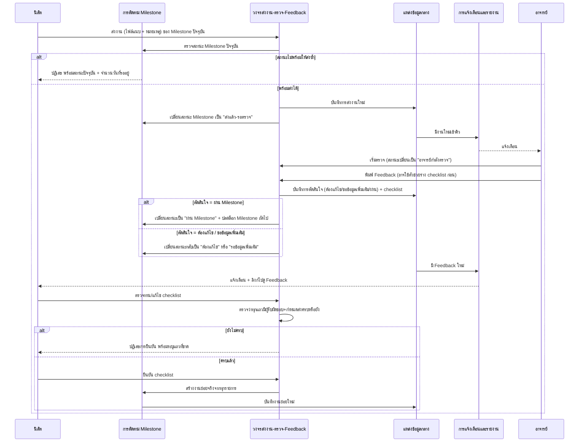
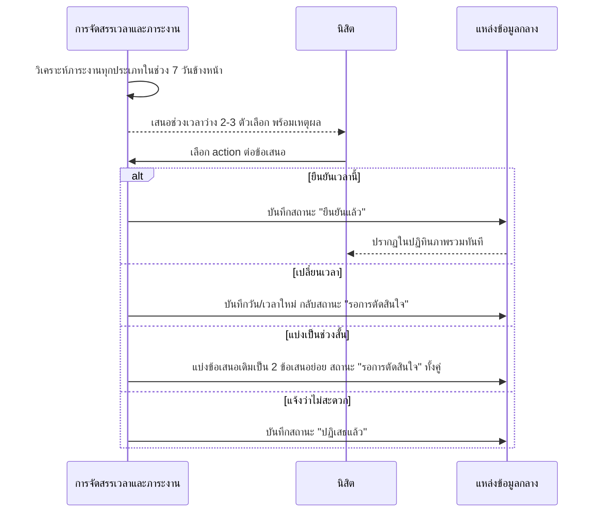
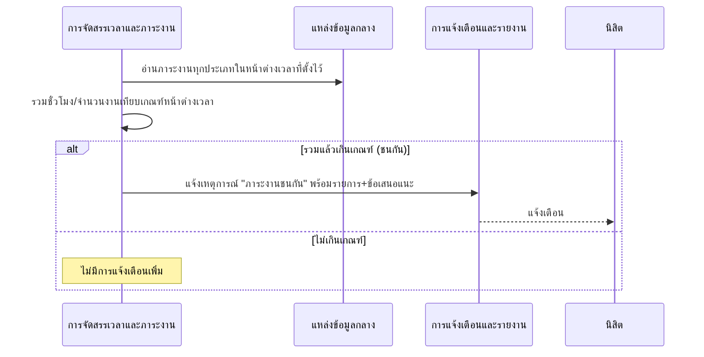
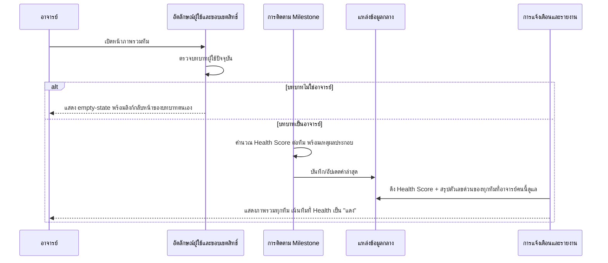
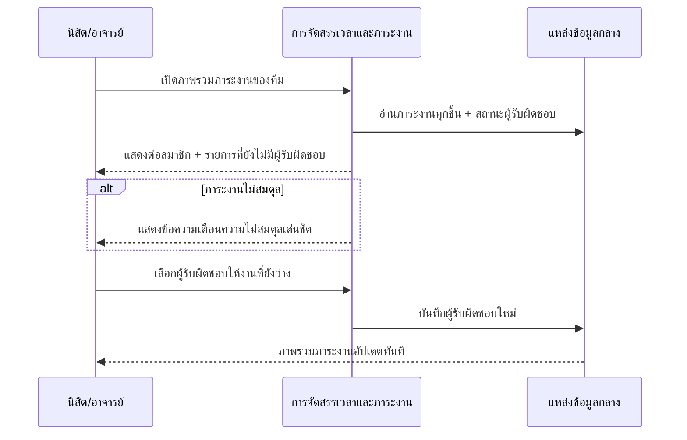
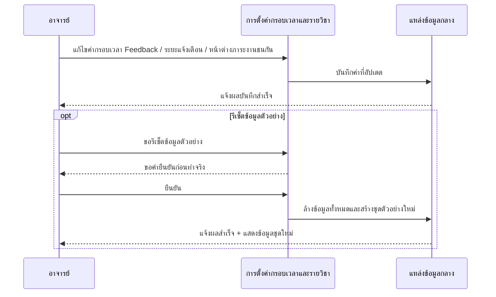
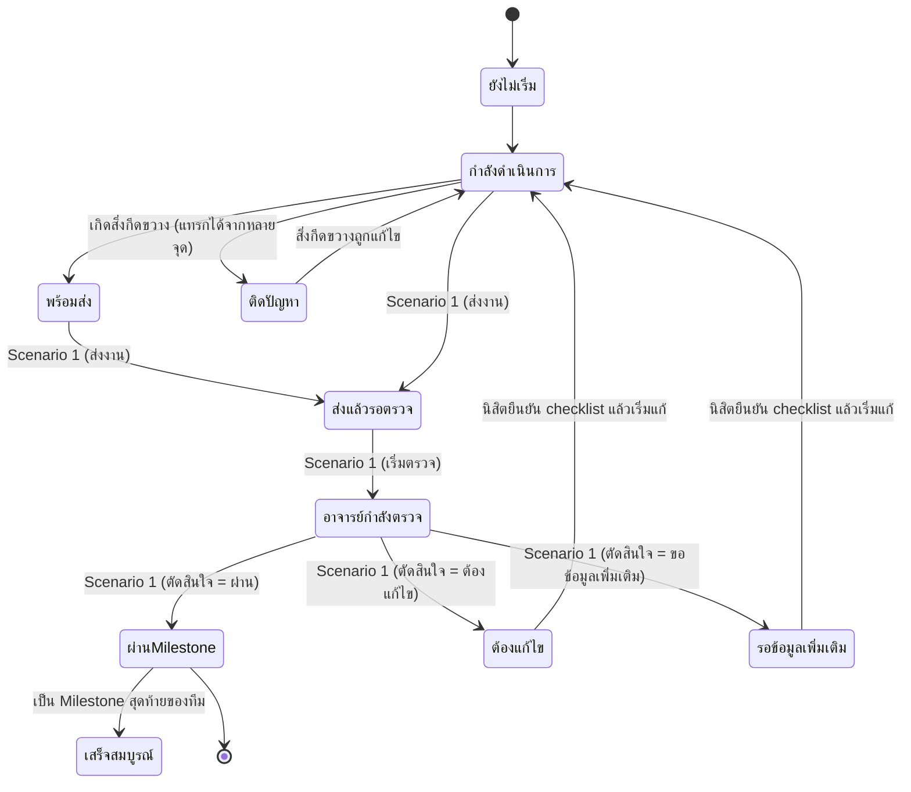
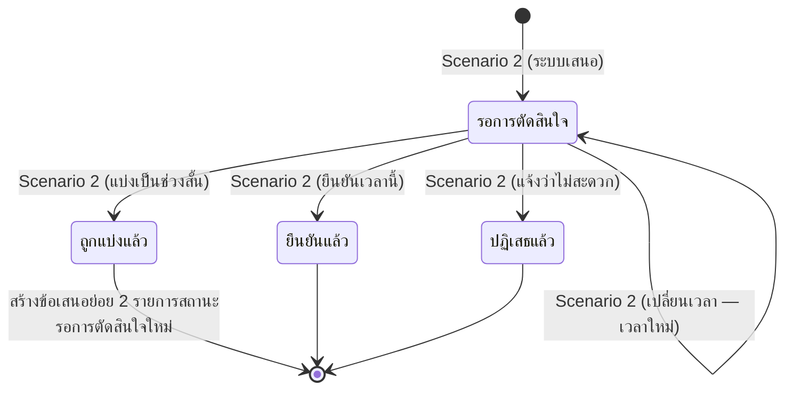

# DETAILED_DESIGN.md — Detailed Design (Conceptual)

เอกสารนี้อธิบาย**ลำดับการทำงานจริงของแต่ละ scenario (conceptual)** ของระบบ ProjectPulse — เมื่อเกิดเหตุการณ์หนึ่งขึ้น แต่ละ [Conceptual Component](ARCHITECTURE.md) คุยกันตามลำดับอย่างไร ตรวจอะไรก่อน-หลัง เกิด error ตอนไหนแล้วระบบทำอะไรต่อ ต่างจาก [ARCHITECTURE.md](ARCHITECTURE.md) ตรงที่เอกสารนั้นให้แค่ภาพรวม data flow ระดับสรุป ส่วนเอกสารนี้ลงรายละเอียดระดับ step ต่อ step ต่างจาก [CONCEPTUAL_API_SPEC.md](CONCEPTUAL_API_SPEC.md) ตรงที่เอกสารนั้นนิยาม operation แต่ละตัวแยกจากกัน ส่วนเอกสารนี้แสดงว่า operation หลายตัวเรียงร้อยกันเป็น scenario การใช้งานจริงอย่างไร — **ไม่ผูกกับ implementation ปัจจุบัน** เช่นเดียวกับเอกสาร conceptual อื่น

**ขอบเขต:** ครอบคลุมทุก scenario หลักที่มีอยู่ใน [SPEC.md](SPEC.md) จัดกลุ่มแบบ **scenario การใช้งานต่อเนื่อง** (1 sequence ครอบคลุมหลาย operation ที่ต้องเกิดต่อกันจริง) พร้อม happy path และ error/alternate flow หลักที่ระบุไว้ใน `SPEC.md`

---

## Scenario 1 — นิสิตส่งงานเข้าคิวตรวจ จนถึงยืนยันงานย่อยจาก Feedback

อ้างอิง operation: ส่งงานเข้าคิวตรวจ, เริ่มตรวจ, ขอข้อมูลเพิ่มเติม, บันทึก Feedback พร้อมการตัดสินใจ, แก้ไขรายการ Checklist, ยืนยัน Checklist กลับเป็นงานย่อย ([CONCEPTUAL_API_SPEC.md](CONCEPTUAL_API_SPEC.md) resource Submission/Feedback)

### Precondition

- Milestone ปัจจุบันของทีมมีสถานะเป็น `กำลังดำเนินการ` หรือ `พร้อมส่ง` (ไม่ใช่ `ส่งแล้ว-รอตรวจ` / `อาจารย์กำลังตรวจ` / `ผ่าน Milestone`)
- ผู้ใช้ที่เริ่ม scenario เป็นนิสิตในทีมเจ้าของ Milestone นั้น

### Sequence Flow

### Decision Points / Validation Order

1. ตรวจสถานะ Milestone ปัจจุบัน**ก่อน**ยอมรับการส่งงานใหม่เสมอ — กันการส่งซ้ำระหว่างที่ยังรอผลตรวจอยู่
2. การตัดสิน "ผ่าน Milestone" ต้องมาจากอาจารย์เท่านั้น และต้องปลดล็อก Milestone ถัดไปในจังหวะเดียวกันเสมอ ไม่แยกเป็นสอง action
3. ก่อนยอมให้นิสิตยืนยัน checklist ต้องตรวจว่าทุกแถวมีผู้รับผิดชอบและกำหนดส่งครบก่อนเสมอ

### Alternate / Error Flow

- **ส่งงานซ้ำระหว่างรอผลตรวจ:** ถ้า Milestone อยู่ในสถานะ `ส่งแล้ว-รอตรวจ`/`อาจารย์กำลังตรวจ`/`ผ่าน Milestone` แล้ว ต้องปฏิเสธฟอร์มส่งงาน (disable) และแสดงสถานะปัจจุบัน + จำนวนวันที่รอตรวจมาแล้วแทน (อ้างอิง [SPEC.md](SPEC.md) หัวข้อ รายละเอียดงานและการส่งไฟล์)
- **ตัดสินใจ "ต้องแก้ไข" หรือ "ขอข้อมูลเพิ่มเติม":** Milestone ไม่ปลดล็อกขั้นถัดไป นิสิตต้องเห็นลิงก์เด่นไปยังหน้า Feedback-to-Task เพื่อดู Feedback ค้างอยู่ (อ้างอิง [SPEC.md](SPEC.md) หัวข้อ รายละเอียดงานและการส่งไฟล์)
- **ยืนยัน checklist ที่ยังไม่ครบข้อมูล:** ปฏิเสธการยืนยัน ระบุชัดว่าแถวไหนขาดผู้รับผิดชอบ/กำหนดส่ง ไม่ยอมสร้างงานย่อยบางส่วน

### Postcondition

- ถ้าผ่าน: Milestone ปัจจุบันมีสถานะ `ผ่าน Milestone`, ทีมปลดล็อก Milestone ถัดไป, ความก้าวหน้าโดยรวมของทีมเพิ่มขึ้น
- ถ้าต้องแก้ไข/ขอข้อมูลเพิ่มเติม: Milestone เดิมมีงานย่อยใหม่ที่แตกจาก checklist รอนิสิตทำต่อ สถานะ Milestone กลับเป็น `กำลังดำเนินการ`

`[ต้องพิจารณา PDPA]` ข้อความ Feedback และผลการตัดสินใจของอาจารย์เป็นข้อมูลประเมินรายทีม/รายบุคคล ต้องจำกัดการมองเห็นเฉพาะทีมเจ้าของงานและอาจารย์ที่ปรึกษาทีมนั้น

---

## Scenario 2 — ระบบแนะนำเวลาว่างและนิสิตตัดสินใจ

อ้างอิง operation: ดูข้อเสนอเวลาว่างที่รอการตัดสินใจ, ยืนยันเวลานี้, เปลี่ยนเวลา, แบ่งเป็นช่วงสั้น, แจ้งว่าไม่สะดวก ([CONCEPTUAL_API_SPEC.md](CONCEPTUAL_API_SPEC.md) resource Free-Time Suggestion)

### Precondition

- ทีมมีข้อมูลภาระงานครบทุกประเภทที่จำเป็น (ตารางเรียน, งานวิชาอื่น, Milestone ปัจจุบัน, เวลาส่วนตัว) เพียงพอให้วิเคราะห์ได้

### Sequence Flow

### Decision Points / Validation Order

1. ต้องพิจารณาภาระงาน**ทุกประเภทที่มีอยู่แล้ว**ก่อนเสนอช่วงเวลาเสมอ — ไม่สรุปจากกำหนดส่งโครงงานเพียงอย่างเดียว (อ้างอิง [SPEC.md](SPEC.md) หัวข้อ Smart Free-Time Planner)
2. ข้อเสนอที่ถูก "ปฏิเสธแล้ว" ต้องไม่ถูกเสนอซ้ำในรอบถัดไป

### Alternate / Error Flow

- ถ้าไม่มีช่วงเวลาว่างที่เหมาะสมเลยในสัปดาห์ข้างหน้า (ภาระงานเต็มหมด) ต้องแสดงสถานะว่างพร้อมคำอธิบายว่าทำไมไม่มีข้อเสนอ แทนการไม่แสดงอะไรเลย

### Postcondition

- รายการที่ยืนยัน/เปลี่ยน/แบ่ง/ปฏิเสธแล้วทั้งหมดต้องแสดงเป็นประวัติด้านล่างของหน้าถัดจากรายการที่ยังรอการตัดสินใจ

---

## Scenario 3 — ตรวจจับภาระงานชนกันและแจ้งเตือน

อ้างอิง operation: ตรวจจับภาระงานชนกัน ([CONCEPTUAL_API_SPEC.md](CONCEPTUAL_API_SPEC.md) resource Team Workload)

### Precondition

- มีภาระงานที่บันทึกไว้ตั้งแต่ 2 รายการขึ้นไปในช่วงเวลาเดียวกัน

### Sequence Flow

### Decision Points / Validation Order

1. หน้าต่างเวลาที่ถือว่า "ชนกัน" ต้องอ่านจากการตั้งค่ากลาง (ดู Scenario 6) ไม่ใช่ค่าคงที่ตายตัวใน component นี้

### Alternate / Error Flow

- ไม่พบการชนกัน: ไม่มี error แต่ต้องไม่สร้างการแจ้งเตือนเปล่าๆ (ความเงียบคือผลลัพธ์ที่ถูกต้อง)

### Postcondition

- นิสิตรับทราบรายการที่ชนกันพร้อมข้อเสนอแนะ อาจนำไปสู่การใช้ Scenario 2 (เปลี่ยน/แบ่งเวลา) เพื่อคลี่คลาย

---

## Scenario 4 — คำนวณ Health Score และแสดงภาพรวมทุกทีมให้อาจารย์

อ้างอิง operation: ดูแดชบอร์ดภาพรวมทุกทีมที่ดูแล, ดูภาพรวมตัวชี้วัดทุกทีม ([CONCEPTUAL_API_SPEC.md](CONCEPTUAL_API_SPEC.md) resource Progress Report)

### Precondition

- ผู้ใช้ปัจจุบันมีบทบาทเป็นอาจารย์ที่ปรึกษา (ยืนยันจาก อัตลักษณ์ผู้ใช้และขอบเขตสิทธิ์)
- แต่ละทีมที่ดูแลมีข้อมูล Milestone/การส่งงานเพียงพอให้คำนวณ Health Score

### Sequence Flow

### Decision Points / Validation Order

1. ต้องตรวจบทบาทผู้ใช้**ก่อน**โหลดข้อมูลทีมเสมอ — กันนิสิตเปิดหน้าเฉพาะอาจารย์แล้วเห็นข้อมูลทีมอื่น (อ้างอิง [SPEC.md](SPEC.md) บทนำ: "ถ้าเปิดผิดบทบาท...ให้ขึ้น empty-state")
2. อาจารย์เห็นได้เฉพาะทีมที่ตนเป็นที่ปรึกษาเท่านั้น ไม่ใช่ทุกทีมในระบบ

### Alternate / Error Flow

- เปิดหน้าผิดบทบาท: แสดง empty-state พร้อมลิงก์กลับ dashboard ของบทบาทตนเอง ไม่ใช่หน้าว่างเปล่าหรือ error ที่ไม่มีทางออก

### Postcondition

- อาจารย์เห็นภาพรวมทุกทีมที่ดูแลพร้อม Health Score และเหตุผลกำกับเสมอ (ห้ามแสดงแค่ตัวเลข/สี)

---

## Scenario 5 — มอบหมายงานที่ยังไม่มีผู้รับผิดชอบในทีม

อ้างอิง operation: ดูภาพรวมภาระงานสมาชิกในทีม, มอบหมายงานที่ยังไม่มีผู้รับผิดชอบ ([CONCEPTUAL_API_SPEC.md](CONCEPTUAL_API_SPEC.md) resource Team Workload)

### Precondition

- มีงานย่อยหรือรายการ checklist อย่างน้อย 1 รายการที่ยังไม่มีผู้รับผิดชอบในทีม

### Sequence Flow

### Decision Points / Validation Order

1. ผู้รับผิดชอบที่เลือกได้ต้องเป็นสมาชิกของทีมนั้นเท่านั้น
2. ต้องตรวจความไม่สมดุลของภาระงาน**ทุกครั้ง**ที่แสดงภาพรวม ไม่ใช่แค่ตอนโหลดครั้งแรก (เพื่อสะท้อนผลหลังมอบหมายทันที)

### Alternate / Error Flow

- ไม่มี edge case เพิ่มเติมนอกเหนือจากความไม่สมดุลที่ต้องแจ้งเตือนเด่น (ครอบคลุมใน Decision Point ข้อ 2)

### Postcondition

- งานที่มอบหมายแล้วมีผู้รับผิดชอบชัดเจน ภาพรวมภาระงานของทุกสมาชิกในทีมสะท้อนข้อมูลล่าสุด

---

## Scenario 6 — อาจารย์ปรับค่ากรอบเวลา Feedback และการแจ้งเตือน

อ้างอิง operation: แก้ไขค่ากรอบเวลา/การแจ้งเตือนกลาง, ตั้งค่าการแจ้งเตือนส่วนตัว, รีเซ็ตข้อมูลตัวอย่าง ([CONCEPTUAL_API_SPEC.md](CONCEPTUAL_API_SPEC.md) resource Course Settings)

### Precondition

- ผู้ใช้ปัจจุบันเข้าหน้าตั้งค่า (นิสิตหรืออาจารย์ก็เข้าได้ แต่สิทธิ์แก้ต่างกัน)

### Sequence Flow

### Decision Points / Validation Order

1. สิทธิ์แก้ค่ากลาง (กรอบเวลา Feedback ฯลฯ) เป็นของอาจารย์เป็นหลัก — นิสิตเห็นค่าปัจจุบันแบบอ่านอย่างเดียว แก้ได้เฉพาะการแจ้งเตือนส่วนตัวของตนเอง
2. การรีเซ็ตข้อมูลตัวอย่างเป็น action ที่ย้อนกลับไม่ได้ **ต้องมีคำยืนยันก่อนทำจริงเสมอ**

### Alternate / Error Flow

- ผู้ใช้ที่ไม่ใช่อาจารย์พยายามแก้ค่ากลาง: ต้องปฏิเสธ ให้เห็นค่าปัจจุบันแบบอ่านอย่างเดียวเท่านั้น
- ผู้ใช้ยกเลิกคำยืนยันก่อนรีเซ็ต: ไม่มีการเปลี่ยนแปลงข้อมูลใดๆ เกิดขึ้น

### Postcondition

- ค่ากรอบเวลาที่อัปเดตแล้วมีผลกับการคำนวณของ Scenario 3 (ตรวจภาระงานชนกัน) และการจัดลำดับคิวใน Scenario 1 ทันทีในการทำงานครั้งถัดไป

---

## State Transition ของ Entity ที่มีหลายสถานะ

### สถานะของ Milestone (อ้างอิง [CONCEPTUAL_DATA_MODEL.md](CONCEPTUAL_DATA_MODEL.md))

หลักการสำคัญ: การเปลี่ยนเป็น `ผ่าน Milestone` เกิดได้จาก Scenario 1 เท่านั้น (ผลจากดุลยพินิจอาจารย์) ไม่มี transition ใดที่นิสิตกระตุ้นให้เกิดสถานะนี้เองได้โดยตรง

### สถานะของ Free-Time Suggestion (อ้างอิง [CONCEPTUAL_DATA_MODEL.md](CONCEPTUAL_DATA_MODEL.md))

---

## Open Questions / Assumptions

- **Scenario 1** ตั้งสมมติฐานว่าการส่งงานใหม่ทับ Milestone เดิมถือเป็นแถวใหม่ในประวัติการส่งงาน (ไม่ใช่แก้ไขแถวเดิม) — ควรยืนยันกับเจ้าของสเปกว่าต้องการเก็บประวัติการส่งย้อนหลังทั้งหมดหรือไม่ (สอดคล้องกับ Open Question เดียวกันใน [CONCEPTUAL_DATA_MODEL.md](CONCEPTUAL_DATA_MODEL.md))
- **Scenario 3** ไม่มีสเปกต้นทางระบุชัดว่าการแจ้งเตือน "ภาระงานชนกัน" ควรเกิดขึ้นทุกครั้งที่มีข้อมูลใหม่เข้ามา หรือเฉพาะเมื่อผู้ใช้เปิดหน้าปฏิทิน — เอกสารนี้ตั้งสมมติฐานแบบหลังไว้ก่อน (ตรวจตอนเปิดหน้า/โหลดข้อมูล) เพราะสอดคล้องกับ Non-functional Considerations ใน [ARCHITECTURE.md](ARCHITECTURE.md) ที่ไม่บังคับเรียลไทม์ระดับวินาที

---

## ความสัมพันธ์กับ Implementation ปัจจุบัน

เอกสาร [DATA_MODEL.md](DATA_MODEL.md) คือการนำ sequence flow เหล่านี้ไปแปลงเป็น implementation จริงบนชั้นข้อมูล client-side ปัจจุบัน (เช่น Scenario 1 ตรงกับลำดับเรียก `PP.submitMilestone` → `PP.startReview`/`PP.requestMoreInfo` → `PP.giveFeedback` → `PP.confirmChecklist` ใน `DATA_MODEL.md`)
