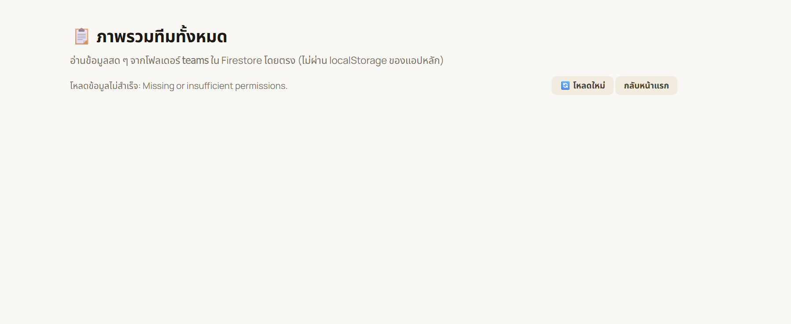

# ProjectPulse

🌐 **URL ออนไลน์:** https://projectpulse2-eb313.web.app

เว็บแอปติดตามความก้าวหน้ารายวิชาโครงงานของนิสิตสาขาการสื่อสารสื่อใหม่ มหาวิทยาลัยพะเยา ใช้แนวคิด **"Pulse"** (ชีพจรของโครงงาน) เพื่อให้ทั้งนิสิตและอาจารย์ที่ปรึกษาเห็นความก้าวหน้าของแต่ละทีมได้ชัดเจนตลอดภาคการศึกษา 16 สัปดาห์ แทนการรอความคืบหน้ามารู้ตอนใกล้ปิดเทอม

## ผู้ใช้งาน

| บทบาท | ทำอะไรได้บ้าง |
|---|---|
| **นิสิต** | ติดตาม Milestone ของทีม, ส่งงานเข้าคิวตรวจ, รับ Feedback แล้วยืนยันเป็นงานย่อย, วางแผนเวลาว่างด้วย Smart Free-Time Planner, ดูภาพรวมภาระงานของทีม |
| **อาจารย์ที่ปรึกษา** | ดูภาพรวมทุกทีมที่ดูแล, จัดคิวงานรอตรวจตามลำดับความสำคัญ, ให้ Feedback และตัดสินผล (แก้ไข/ขอข้อมูลเพิ่มเติม/ผ่าน Milestone), ตั้งค่ากรอบเวลา Feedback |

## เอกสารออกแบบระบบ

| เอกสาร | เนื้อหา |
|---|---|
| [SPEC.md](SPEC.md) | สเปกฟังก์ชันรายหน้า (ผูกกับ implementation ปัจจุบัน) |
| [DATA_MODEL.md](DATA_MODEL.md) | Data model + client-side API reference (`PP.*`) |
| [ARCHITECTURE.md](ARCHITECTURE.md) | High-Level Architecture ระดับ conceptual — System Context, Component, Data Flow ตาม Scenario, Non-functional Considerations |
| [CONCEPTUAL_DATA_MODEL.md](CONCEPTUAL_DATA_MODEL.md) | Conceptual Data Model — entity/attribute/ความสัมพันธ์ พร้อม ER Diagram |
| [CONCEPTUAL_API_SPEC.md](CONCEPTUAL_API_SPEC.md) | Conceptual API Spec — resource/operation ระดับแนวคิด |
| [DETAILED_DESIGN.md](DETAILED_DESIGN.md) | Detailed Design — sequence flow ต่อ scenario พร้อม state transition |

เอกสารระดับ conceptual (`ARCHITECTURE.md`, `CONCEPTUAL_DATA_MODEL.md`, `CONCEPTUAL_API_SPEC.md`, `DETAILED_DESIGN.md`) ไม่ผูกกับ implementation ปัจจุบัน ใช้ Mermaid diagram ตลอด (render อัตโนมัติบน GitHub)

## ฐานข้อมูลจริง (Firestore)

โปรเจกต์นี้เชื่อมกับ [Cloud Firestore](https://firebase.google.com/products/firestore) จริงแล้ว (นอกเหนือจาก localStorage ที่แอปหลักยังใช้อยู่) — ดูรายละเอียด:

- [firebase-config.js](assets/js/firebase-config.js) — การตั้งค่าเชื่อมต่อ
- [seed-firestore.html](seed-firestore.html) — สคริปต์ใส่ข้อมูลตัวอย่าง (`advisors` 3 รายการ, `teams` 5 รายการ)
- [firestore-teams.html](firestore-teams.html) — หน้ารายการทีมที่อ่านข้อมูลสดจาก Firestore โดยตรง

Firestore Security Rules บังคับ **"ต้องล็อกอินก่อนเสมอ"** ([firestore.rules](firestore.rules)) — ภาพด้านล่างคือหน้าต่างส่วนตัว (Incognito) ที่ไม่ได้ล็อกอิน แล้วพยายามอ่าน collection `teams` ตรงจาก [firestore-teams.html](firestore-teams.html) ได้รับ `permission-denied` ตามที่กฎกำหนดไว้:



## เทคโนโลยีที่ใช้ (Implementation ปัจจุบัน)

Prototype แบบ static เว็บล้วน ไม่มี backend/database จริง — ข้อมูลทั้งหมดเก็บใน **localStorage** ของเบราว์เซอร์ผ่านชั้นข้อมูล `assets/js/store.js` (`window.PP`)

```
pages/            หน้าแต่ละหน้า (HTML)
assets/js/        ชั้นข้อมูล + ตรรกะธุรกิจ + สคริปต์เฉพาะหน้า
assets/css/       ดีไซน์ระบบ (สีกรมท่า/ม่วง/ฟ้า, responsive)
index.html        หน้าเข้าสู่ระบบ/เลือกบทบาท
bundle.html       เวอร์ชันไฟล์เดียวรวมทุกหน้า (single-file build)
```

## วิธีรันดูตัวอย่าง

**วิธีที่ 1 — ใช้เว็บเซิร์ฟเวอร์ในเครื่อง (แนะนำ)**

```powershell
powershell -ExecutionPolicy Bypass -File .\serve.ps1
```

จะเปิดเบราว์เซอร์ไปที่ `http://localhost:8791/` อัตโนมัติ (ต้องรันผ่านเซิร์ฟเวอร์ ไม่ใช่เปิดไฟล์ตรงๆ เพราะเบราว์เซอร์บางตัวจำกัดการใช้ localStorage บนหน้าที่เปิดแบบ `file://`)

**วิธีที่ 2 — เปิด `bundle.html`**

เปิดไฟล์ `bundle.html` ในเบราว์เซอร์ได้โดยตรง เป็นเวอร์ชันไฟล์เดียวที่รวมทุกหน้าไว้แล้ว

## รีเซ็ตข้อมูลตัวอย่าง

ระบบมีข้อมูลจำลอง (ทีม, Milestone, การส่งงาน ฯลฯ) มาให้ตั้งแต่ต้น — ถ้าต้องการล้างกลับสภาพเริ่มต้น ไปที่หน้า **ตั้งค่า** แล้วกด "รีเซ็ตข้อมูลตัวอย่าง"
